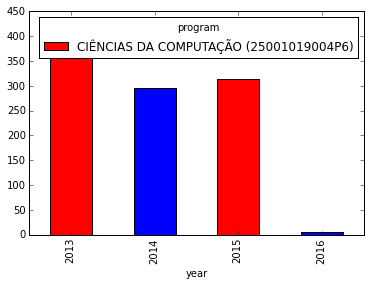
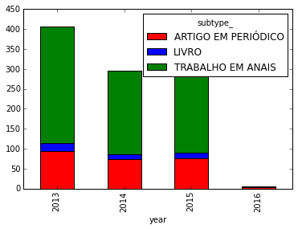
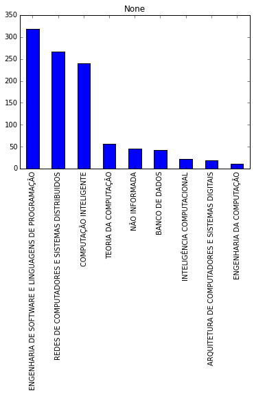
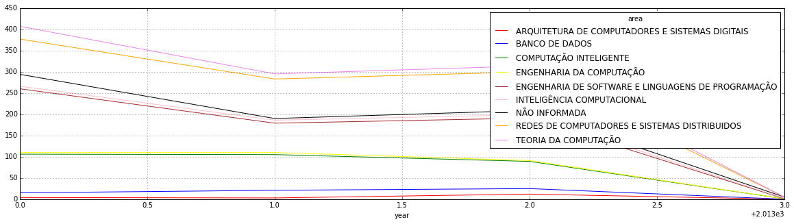
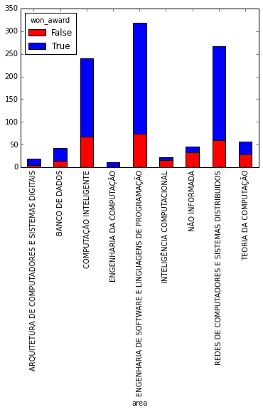
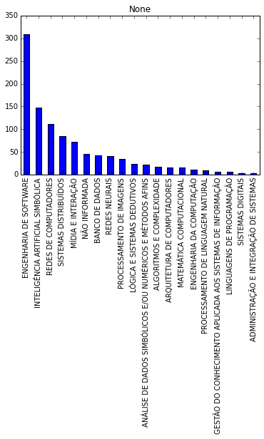
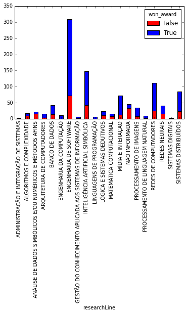
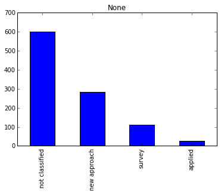
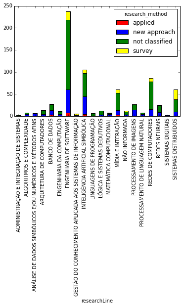

    %matplotlib inline
    import pandas as pd
    import numpy as np
    import matplotlib as plt
    import matplotlib.pyplot as plt2
    df = pd.read_csv('result.csv')

    list(df.columns.values)

    ['area',
     'authors/0/category',
     'authors/0/name',
     'authors/0/order',
     'authors/1/category',
     'authors/1/name',
     'authors/1/order',
     'authors/2/category',
     'authors/2/name',
     'authors/2/order',
     'authors/3/category',
     'authors/3/name',
     'authors/3/order',
     'authors/4/category',
     'authors/4/name',
     'authors/4/order',
     'authors/5/category',
     'authors/5/name',
     'authors/5/order',
     'authors/6/category',
     'authors/6/name',
     'authors/6/order',
     'authors/7/category',
     'authors/7/name',
     'authors/7/order',
     'authors/8/category',
     'authors/8/name',
     'authors/8/order',
     'extension/advertising',
     'extension/edition',
     'extension/event_city',
     'extension/event_country',
     'extension/event_name',
     'extension/fasciculo',
     'extension/idiom',
     'extension/isbn_issn',
     'extension/n_finalPage',
     'extension/n_startPage',
     'extension/nature',
     'extension/observation',
     'extension/serie',
     'extension/title',
     'extension/url',
     'extension/volume',
     'ies',
     'name',
     'program',
     'researchLine',
     'researchProjet',
     'subtype_',
     'type_',
     'year',
     'extension/city',
     'extension/doi',
     'extension/editor',
     'extension/issn',
     'extension/advertising_mode',
     'extension/author_info',
     'extension/award',
     'extension/award_date',
     'extension/city_country',
     'extension/content_nature',
     'extension/contribution_type',
     'extension/distribution',
     'extension/editor_type',
     'extension/editorial_city',
     'extension/editorial_conselor',
     'extension/funding',
     'extension/indication_date',
     'extension/indice',
     'extension/institution',
     'extension/isbn',
     'extension/name_funding',
     'extension/page_count',
     'extension/page_count_contribution',
     'extension/parecer',
     'extension/reedition',
     'extension/reference_work',
     'extension/reimpresion',
     'extension/tiragem',
     'extension/year_fst_pusblish',
     'authors/9/category',
     'authors/9/name',
     'authors/9/order',
     'authors/10/category',
     'authors/10/name',
     'authors/10/order',
     'authors/11/category',
     'authors/11/name',
     'authors/11/order',
     'authors/12/category',
     'authors/12/name',
     'authors/12/order',
     'authors/13/category',
     'authors/13/name',
     'authors/13/order',
     'authors/14/category',
     'authors/14/name',
     'authors/14/order',
     'authors/15/category',
     'authors/15/name',
     'authors/15/order',
     'authors/16/category',
     'authors/16/name',
     'authors/16/order',
     'authors/17/category',
     'authors/17/name',
     'authors/17/order',
     'authors/18/category',
     'authors/18/name',
     'authors/18/order',
     'authors/19/category',
     'authors/19/name',
     'authors/19/order',
     'authors/20/category',
     'authors/20/name',
     'authors/20/order',
     'authors/21/category',
     'authors/21/name',
     'authors/21/order',
     'authors/22/category',
     'authors/22/name',
     'authors/22/order',
     'authors/23/category',
     'authors/23/name',
     'authors/23/order',
     'authors/24/category',
     'authors/24/name',
     'authors/24/order',
     'authors/25/category',
     'authors/25/name',
     'authors/25/order',
     'authors/26/category',
     'authors/26/name',
     'authors/26/order',
     'authors/27/category',
     'authors/27/name',
     'authors/27/order',
     'authors/28/category',
     'authors/28/name',
     'authors/28/order',
     'authors/29/category',
     'authors/29/name',
     'authors/29/order',
     'authors/30/category',
     'authors/30/name',
     'authors/30/order',
     'authors/31/category',
     'authors/31/name',
     'authors/31/order',
     'authors/32/category',
     'authors/32/name',
     'authors/32/order']

##Qual a quantidade de trabalhos por ano (de 2013 ao meio de 2016)
Nenhuma diferença gritante entre os anos

    pd.crosstab(df['year'], df['program']).plot(kind='bar', stacked=True, color=['red','blue'], grid=False)

    <matplotlib.axes._subplots.AxesSubplot at 0x106f5d610>

##Qual o tipo de trabalho mais publicado em cada ano?

    pd.crosstab(df['year'], df['subtype_']).plot(kind='bar', stacked=True, color=['red','blue','green'], grid=False)

    <matplotlib.axes._subplots.AxesSubplot at 0x106f38c50>

##Quantidade de publicações por área

    df['area'].value_counts().plot(kind='bar', subplots=True)

    array([<matplotlib.axes._subplots.AxesSubplot object at 0x275db5e10>], dtype=object)

##Quantidade de publicações por ano

    pd.crosstab(df['year'], df['area']).plot(figsize=(20,5), kind='line', stacked=True, color=['red','blue','green','yellow','brown','pink','black','orange','violet'], grid=True)

    <matplotlib.axes._subplots.AxesSubplot at 0x11131fc90>

## Trabalhos selecionados para conferências
726 trabalhos foram apresentados em eventos

    df['won_award'] = df['extension/event_name'].isnull() == False

    pd.crosstab(df['area'], df['won_award']).plot(kind='bar', stacked=True, color=['red','blue','green'], grid=False)

    <matplotlib.axes._subplots.AxesSubplot at 0x10ad9e9d0>

##Quantidade de trabalhos por área de pesquisa

    df['researchLine'].value_counts().plot(kind='bar', subplots=True)
    #df['area'].value_counts().plot(kind='bar', subplots=True)

    array([<matplotlib.axes._subplots.AxesSubplot object at 0x29366b990>], dtype=object)

##Quantidade de trabalhos apresentados em eventos por área de pesquisa

    pd.crosstab(df['researchLine'], df['won_award']).plot(kind='bar', stacked=True, color=['red','blue','green'], grid=False)

    <matplotlib.axes._subplots.AxesSubplot at 0x10af60090>

##Tentando analisar o tipo de pesquisa

    def get_research_method(title):
        if "CASE" in title:
            return "applied"
        if "SURVEY" in title or "EVALUATION" in title or "STUDY" in title or "ANALYSIS" in title:
            return "survey"
        if "APPROACH" in title or "FRAMEWORK" in title or "ALGORITHM" in title or "BASED" in title or "USING" in title or "METHOD" in title:
            return "new approach"
        else:
            return "not classified"

    df['research_method'] = df['name'].apply(get_research_method)

    df['research_method'].value_counts().plot(kind='bar', subplots=True)

    array([<matplotlib.axes._subplots.AxesSubplot object at 0x10c2f8910>], dtype=object)

    pd.crosstab(df[df['won_award']==True]['researchLine'], df['research_method']).plot(kind='bar', stacked=True, color=['red','blue','green','yellow'], grid=False)

    <matplotlib.axes._subplots.AxesSubplot at 0x10cd25ed0>

