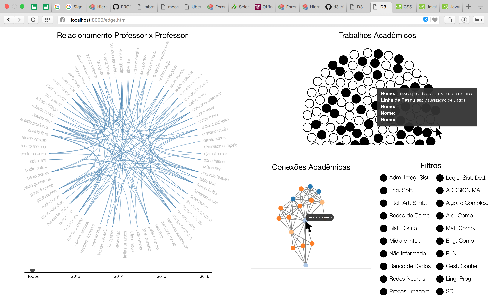
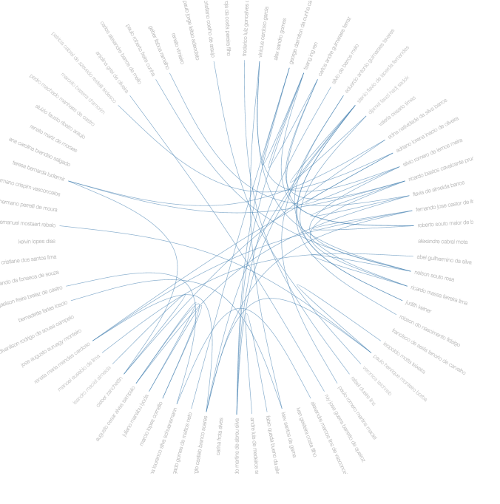
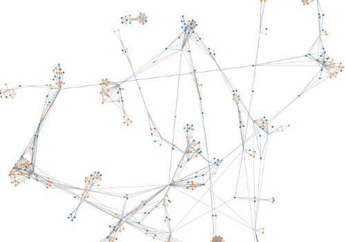

# Produção Acadêmica Cin 2013-2016

## Vistas
* Relacionamento Professor x Professores
* Conexões entre autores (grafo)
* Trabalhos acadêmicos (metadados)

## Tecnologias
* D3.js
* Crossfilter

# Especificações sobre cada vista
### Relacionamento Professor x Professor

#### Dados
Cada trabalho apresenta os seguintes campos:

| Campo       | Tipo          | Descrição  |
| ------------- |:-------------:| -----:|
| authors     | array | Tipo do autor(discente, docente), nome, index|
| extension     | array      |   Informações extras referente ao trabalho acadêmico |
| ies | String     |    Instituição de Ensino Superior |
| name | String     |    Nome do trabalho |
| program | String     |    Curso |
| researchLine | String     |    Área de pesquisa |
| researchProject | String     |    Projeto de pesquisa onde o trabalho foi desenvolvido |
| year | String     |    Ano em que o trabalho foi desenvolvido |

Este vista utiliza os dados do campo *authors* e mostra apenas a colaboração entre docentes (professores).

Primeiro todos os autores do dataset são armazenados na variável people[] e classificados de acordo com o papel deles no trabalho (docente, discente, participante externo ou outros).

Em seguida é criada uma matriz com todas as relações entre os autores do dataset, cujo valor é a quantidade de vezes que os dois autores trabalharam juntos (ou seja, a quantidade de trabalhos onde ambos os autores estão presentes).

Por fim as conexões são apresentadas utilizando D3.

### Conexões entre autores (grafo)

#### Dados
Esta vista também utililza apenas os dados do campo *authors*. A dinâmica é a mesma, só que agora utilizamos todos os tipos de autores (docentes, discentes, colaboradores externos e outros).

### Trabalhos acadêmicos (metadados)
#### Dados

Esta vista utiliza o array de metadados sobre os trabalhos (campo *extension*) e mostra para o usuário através de um bubble graph com os trabalhos.

# Vistas múltiplas

Ações em cada uma das vistas devem mudar o estado das outras, da seguinte forma

|  Ação |  Vista 1 [Relações] |  Vista 2 [Trabalhos] |  Vista 3 [Conexões] |
|---|---|---|---|
| Clicar em um professor na V1  |  - | Mostrar apenas os trabalhos deste professor  |  Focar o grafo no professor|
| Clicar em um trabalho na V2  | Mostrar a ligação específica dos autores neste trabalho  | -  | Focar no do trabalho autor mais conectado  |
| Clicar em um professor na V3  | Selecionar o professor  |  Mostrar os trabalhos deste professor | -  |
| Clicar um dos filtros de linha de pesquisa | Mudar a cor dos professores que publicaram nesta linha de pesquisa |  Mostrar apenas os trabalhos desta linha de pesquisa | Colocar uma borda nos autores que publicaram nesta linha de pesquisa |
| Filtrar por ano  | Mudar a cor dos professores que publicaram no ano selecionado  |  Mostrar apenas os trabalhos publicados no ano selecionado | Colocar uma borda nos autores que publicaram durante o ano selecionado |

Para a filtrar os dados de acordo com os requisitos usamos a biblioteca Crossfilter.

Criamos novos datasets com alguns dados já precessados para facilitar os próximos passos.
* .json com professor_name,academic_work_ids[],professors_worked_with[]
* .json com professor_name,people_worked_with[{name, group,index_local,quantity_collaborations}]
* .json com academic_work_ids[],professor1,professor2
* .json com research_line,authors[]
* .json com author,published_work_years[]
